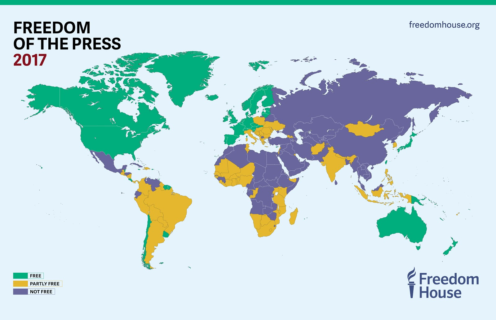
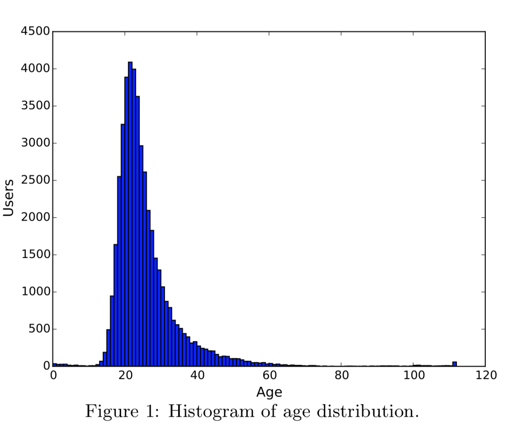
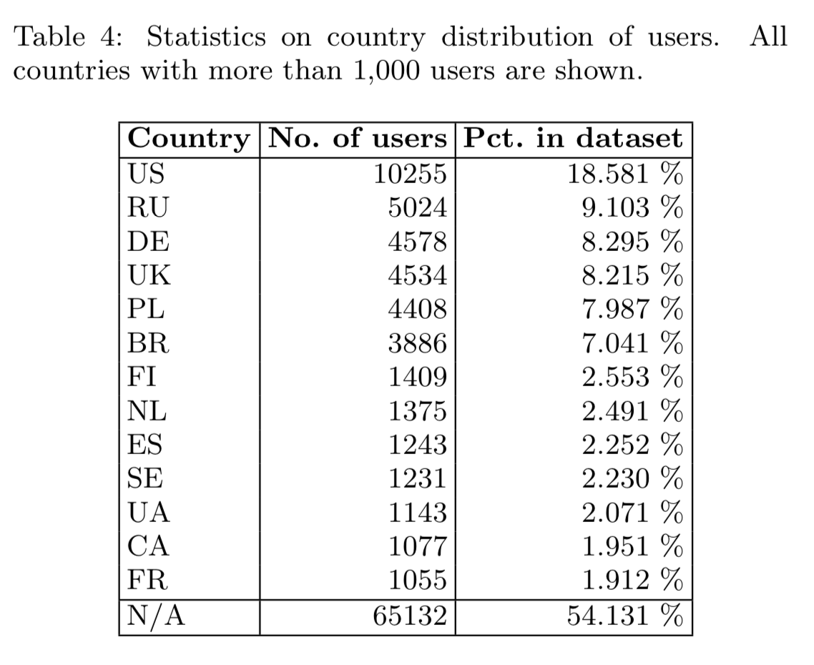

# Blog Post I 

**Source:** [https://freedomhouse.org/report/freedom-press/freedom-press-2017](https://freedomhouse.org/report/freedom-press/freedom-press-2017)

## Introduction

Welcome to “The Sound of Censorship”. In this project we will be exploring how censorship affects the listening habits of a person. This will be accomplished by collecting 2 datasets, one involved with user listening habits and the other about countries’ freedom of expression situation. We will be trying to find what type of predictors like user data (ex: age, country…) or country data (ex: press freedom index, internet freedom rankings...) affect these habits (ex: how many novel artists has the user listened this past week, how are different age groups affected by this?).

## Data Collection & Structure

So far we have collected data mainly from 3 sources:

* The user data from: [**LFM-1b**](http://www.cp.jku.at/datasets/LFM-1b/)

  We chose this dataset because it was one of the *very few* that gave demographic information on the user. Another advantage was the variety of places the users are located in. This is a very large dataset so we will have to pick a good cloud platform to store it in.

* The country data from:

  * [**World Bank**](https://tcdata360.worldbank.org/indicators/h3f86901f?country=BRA&indicator=32416&viz=line_chart&years=2001,2015): This dataset is involved with press freedom, therefore it has also predictors outside of Internet restrictions.
  * [**Freedom House**](https://freedomhouse.org/report/freedom-net/freedom-net-2018/rise-digital-authoritarianism): An organization known for its reports in the domain of freedom of expression, Freedom House collected a dataset that has detailed predictors like “number of obstacles to access” or “violations of user rights”. Since Last FM is a online streaming service, we expect this dataset to be very significant with the user data.

Cleaning these datasets mainly involved dropping certain features that seemed very irrelevant like the user’s registering timestamps from the user data. We used pycountry, a package that has all types of country codes to the country symbols in all of the datasets match. This way we can JOIN tables in comfort! We also changed string type of data to numerical (ex: {"NOT FREE": 0, "PARTLY FREE": 1, "FREE": 2}).

Currently we store/manage our data in a mix of Google Drive and Colab. However we are also in the process of looking at Google Cloud SDK. Due to the size of our dataset and the 12 hour limit put by Google’s Colab, we plan on using the CS department grid to run predictive modeling trainings.

## Hypotheses

* **Age - Number of Listening Events:** We expect that younger generations (age 0 - 35) would find the obstacles put by the government less of a problem (ex: ease at using VPN) and have listening habits that are similar to the ones in countries. This also means that we expect the opposite from older generations.
* **Country Internet Ranking - Novelty in Artist/Track/Album Listened:** We expect a correlation between the variety of musicians listened and the Internet freedom ranking of the country where the user is located. A country with higher ranking in freedom of Internet may have more medium to spread information about other (novel to the user) music.
* **Country Internet Ranking - Distinct Number of Artist/Track/Album Listened:** We expect a correlation between the number of musicians listened and the Internet freedom ranking of the country where the user is located. The motivation behind this is similar to the hypothesis above.
* We are unsure as to whether press freedom indicators will be as significant as Internet freedom indicators for listening habits.

## Challenges

We had several challenges from the beginning of our project. First of all, it was hard to find user data due to privacy reasons and company policies. This is why finding the LFM-1b dataset was an amazement/relief. 

Another problem we had was the size of our data. We had an issue on deciding where to store it. Even if we put it somewhere like Google Drive we have certain concerns about training time and making calls for downloading a part of it for each batch. However it seems as if the CS department grid and a mixture of Google applications will help us to tackle this problem.

Other challenges that we think we might run into is the ratio of data per country and whether the press freedom indicators will be as strong as the internet one as mentioned above.

## Plan of Actions

1. By next time we definitely would like to make correlation analyses.
2. We would like to test some of our hypotheses with these analyses.
3. With the conclusions that we can draw from the tests, we want to prepare our predictive model (choose which features and what type of a ML model to use) that shows how the listening habit of a person might be predicted by these indicators.
4. If we have time or think is of interest we would like to collect music features from Spotify. However, since the track and album datasets are very large we do not know if this is feasible. By next time we would like to either completely forget about this or start to do it.

	

Source: [**The LFM-1b Dataset for Music Retrieval and Recommendation**](http://www.cp.jku.at/people/schedl/Research/Publications/pdf/schedl_icmr_2016.pdf)

